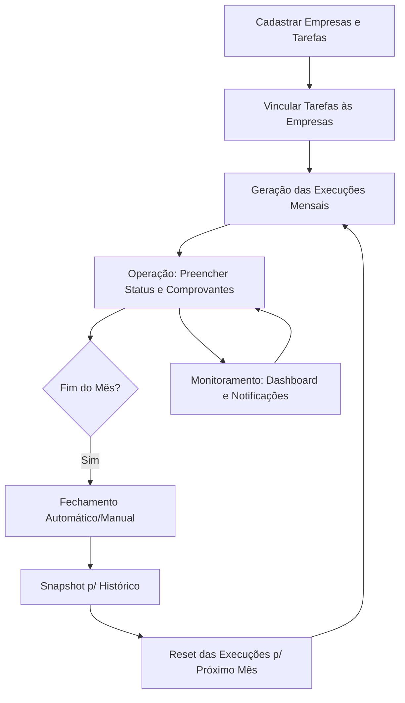

# Central de Tarefas — Documentação Completa da API

> API REST de controle de tarefas mensais para escritórios de contabilidade.
> Stack: **Node.js + Express + SQLite (better-sqlite3)** · Dashboard web embutido · Autenticação JWT.

---

## Sumário

1. [Visão Geral](#visão-geral)
2. [Fluxo do Sistema](#fluxo-do-sistema)
3. [Como rodar](#como-rodar)
4. [Banco de Dados](#banco-de-dados)
5. [Autenticação](#autenticação)
6. [Endpoints](#endpoints)
   - [Auth](#auth)
     - [`POST /api/auth/login`](#post-apiauthlogin)
     - [`GET /api/auth/me`](#get-apiauthme)
   - [Configurações](#configurações)
     - [`GET /api/configuracoes`](#get-apiconfiguracoes)
     - [`PUT /api/configuracoes`](#put-apiconfiguracoes)
   - [Competência](#competência)
     - [`GET /api/competencia`](#get-apicompetencia)
     - [`PUT /api/competencia`](#put-apicompetencia)
   - [Empresas](#empresas)
     - [`GET /api/empresas`](#get-apiempresas)
     - [`GET /api/empresas/:id`](#get-apiempresasid)
     - [`POST /api/empresas`](#post-apiempresas)
     - [`POST /api/empresas/import`](#post-apiempresasimport)
     - [`PUT /api/empresas/:id`](#put-apiempresasid)
     - [`DELETE /api/empresas/:id`](#delete-apiempresasid)
   - [Tarefas](#tarefas)
     - [`GET /api/tarefas`](#get-apitarefas)
     - [`GET /api/tarefas/:id`](#get-apitarefasid)
     - [`POST /api/tarefas`](#post-apitarefas)
     - [`PUT /api/tarefas/:id`](#put-apitarefasid)
     - [`DELETE /api/tarefas/:id`](#delete-apitarefasid)
   - [Execuções](#execuções)
     - [`GET /api/execucoes`](#get-apiexecucoes)
     - [`GET /api/execucoes/:id`](#get-apiexecucoesid)
     - [`PUT /api/execucoes/:id`](#put-apiexecucoesid)
     - [`POST /api/execucoes/:id/comprovante`](#post-apiexecucoesidcomprovante)
     - [`POST /api/execucoes/reset`](#post-apiexecucoesreset)
   - [Gestão Mensal](#gestão-mensal-fecharreabrir-mês)
     - [`POST /api/mes/fechar`](#post-apimesfechar)
     - [`POST /api/mes/reabrir`](#post-apimesreabrir)
   - [Histórico](#histórico)
     - [`GET /api/historico/meses`](#get-apihistoricomeses)
     - [`GET /api/historico/resumo`](#get-apihistoricoresumo)
     - [`GET /api/historico`](#get-apihistorico)
     - [`PUT /api/historico/:id`](#put-apihistoricoid)
   - [Notificações](#notificações)
     - [`GET /api/notificacoes`](#get-apinotificacoes)
   - [Dashboard](#dashboard)
     - [`GET /api/dashboard`](#get-apidashboard)
     - [`GET /api/dashboard/matrix`](#get-apidashboardmatrix)
     - [`GET /api/dashboard/sla`](#get-apidashboardsla)
   - [Automação MeuDANFE](#automação-meudanfe)
     - [`POST /api/fiscal/meudanfe/sync`](#post-apifiscalmeudanfesync)
7. [Módulo NFS-e](#módulo-de-automação-captura-nfs-e-nacional)
   - [Cofre de Credenciais](#2-cofre-de-credenciais-security-vault)
   - [Automação e Fila](#3-automação-e-fila-jobs)
8. [Regras de negócio](#regras-de-negócio)
9. [Status válidos](#status-válidos)
10. [Dados de exemplo (seed)](#dados-de-exemplo-seed)
11. [Decisões de arquitetura](#decisões-de-arquitetura)
12. [Changelog](./CHANGELOG.md)

---

## Visão Geral

O Central de Tarefas controla tarefas mensais recorrentes de um escritório de contabilidade, associando cada tarefa a cada empresa cliente.

## Fluxo do Sistema



O ciclo funciona assim:

1. Cadastra-se empresas e tarefas (templates).
2. Para cada empresa, define-se quais tarefas se aplicam (habilitadas/desabilitadas).
3. O mês corrente é operado via **Execuções** — cada execução é uma tarefa × empresa com campos de registro.
4. Ao final do mês, executa-se o **fechamento** — as execuções são arquivadas no **Histórico** e o mês corrente é resetado. O fechamento também ocorre automaticamente todo dia 1º via **Cron Job**.
5. O **Dashboard** mostra percentuais de conclusão por tarefa, empresa e categoria, e métricas de qualidade de entrega (SLA de Prazo).

---

## Como rodar

### Pré-requisitos

- Node.js **v20 LTS ou superior** (recomendado: v22 LTS)
  - ⚠️ Node.js v24+ requer `better-sqlite3` v11+. Este projeto já usa v11.
- macOS, Linux ou Windows

### Instalação

```bash
# 1. Extrair o ZIP
unzip taskapi.zip
cd taskapi

# 2. Instalar dependências
npm install

# 3. Configurar variáveis de ambiente
# Crie um arquivo .env na raiz do projeto contendo:
# PORT=3000
# DB_PATH=./tarefas.db
# JWT_SECRET=sua_chave_secreta_aqui

# 4. Iniciar o servidor
node server.js
```

### Acessar

| Recurso | URL |
|---|---|
| Dashboard web | http://localhost:3000 |
| API base | http://localhost:3000/api |

### Credenciais padrão (primeiro acesso)

| Campo | Valor |
|---|---|
| E-mail | admin@admin.com |
| Senha | 123456 |

> ⚠️ Altere a senha padrão após o primeiro login em produção.

### Banco de dados

O arquivo `tarefas.db` (SQLite) é criado automaticamente na primeira execução no diretório raiz do projeto. Dados de exemplo são inseridos automaticamente se o banco estiver vazio.

---

## Banco de Dados

### Tabelas

#### `usuarios`
Usuários do sistema com controle de hierarquia.

| Campo | Tipo | Descrição |
|---|---|---|
| `id` | INTEGER PK | Auto-incremento |
| `nome` | TEXT NOT NULL | Nome completo |
| `email` | TEXT UNIQUE | E-mail de acesso |
| `senha_hash` | TEXT | Senha criptografada com bcrypt |
| `role` | TEXT | `admin` ou `colaborador` (padrão: colaborador) |
| `criado_em` | TEXT | Timestamp de criação |

#### `configuracoes`
Configurações globais do sistema.

| Campo | Tipo | Descrição |
|---|---|---|
| `id` | INTEGER PK | Auto-incremento |
| `nome_escritorio` | TEXT | Nome de exibição do escritório |

#### `empresas`
Clientes do escritório.

| Campo | Tipo | Descrição |
|---|---|---|
| `id` | INTEGER PK | Auto-incremento |
| `nome` | TEXT NOT NULL | Razão social ou nome fantasia |
| `cnpj` | TEXT | CNPJ ou CPF (sem formatação forçada) |
| `regime` | TEXT | SIMPLES, MEI, PRESUMIDO, REAL ou CEI |
| `ativo` | INTEGER | 1 = ativa, 0 = inativa (padrão: 1) |
| `criado_em` | TEXT | Timestamp de criação |

#### `tarefas`
Templates de tarefas mensais recorrentes.

| Campo | Tipo | Descrição |
|---|---|---|
| `id` | INTEGER PK | Auto-incremento |
| `nome` | TEXT NOT NULL | Nome da tarefa |
| `categoria` | TEXT | Fiscal, Contábil, Dep. Pessoal, Obrigações Acessórias, Administrativo |
| `descricao` | TEXT | Descrição detalhada opcional |
| `dia_vencimento` | INTEGER | Dia do mês limite para conclusão (1–31) |
| `criado_em` | TEXT | Timestamp de criação |

#### `empresa_tarefas`
Relacionamento muitos-para-muitos que define quais tarefas cada empresa deve executar.

| Campo | Tipo | Descrição |
|---|---|---|
| `empresa_id` | INTEGER FK | Referência a `empresas.id` |
| `tarefa_id` | INTEGER FK | Referência a `tarefas.id` |
| `ativo` | INTEGER | 1 = habilitada, 0 = não se aplica |

> **Importante:** Esta tabela é a fonte de verdade para o Dashboard. Métricas consideram somente tarefas com `ativo = 1` para cada empresa.

#### `execucoes`
Registros do mês corrente — uma linha por empresa × tarefa habilitada.

| Campo | Tipo | Descrição |
|---|---|---|
| `id` | INTEGER PK | Auto-incremento |
| `empresa_id` | INTEGER FK | Referência a `empresas.id` |
| `tarefa_id` | INTEGER FK | Referência a `tarefas.id` |
| `status` | TEXT | pendente / em_andamento / concluida / bloqueada |
| `o_que_foi_feito` | TEXT | Descrição do trabalho realizado |
| `quando` | TEXT | Data de execução (YYYY-MM-DD) |
| `observacoes` | TEXT | Anotações livres |
| `responsavel` | TEXT | Preenchido automaticamente com o nome do usuário logado |
| `comprovante` | TEXT | Nome do arquivo de comprovante (salvo em `/public/uploads/`) |
| `criado_em` | TEXT | Timestamp de criação |
| `atualizado_em` | TEXT | Timestamp da última atualização |

> Constraint `UNIQUE(empresa_id, tarefa_id)` garante uma linha por par.

#### `historico`
Arquivo imutável de execuções passadas. Cada fechamento de mês grava um snapshot completo aqui.

| Campo | Tipo | Descrição |
|---|---|---|
| `id` | INTEGER PK | Auto-incremento |
| `empresa_id` | INTEGER | ID da empresa (pode ser NULL se empresa foi removida) |
| `tarefa_id` | INTEGER | ID da tarefa (pode ser NULL se tarefa foi removida) |
| `empresa_nome` | TEXT NOT NULL | Nome desnormalizado (preservado mesmo se empresa for deletada) |
| `tarefa_nome` | TEXT NOT NULL | Nome desnormalizado |
| `categoria` | TEXT | Categoria da tarefa no momento do fechamento |
| `mes_referencia` | TEXT | Formato YYYY-MM (ex: 2026-04) |
| `o_que_foi_feito` | TEXT | Descrição copiada da execução |
| `quando` | TEXT | Data copiada da execução |
| `observacoes` | TEXT | Observações copiadas |
| `status` | TEXT | Status no momento do fechamento |
| `responsavel` | TEXT | Responsável copiado |
| `comprovante` | TEXT | Nome do arquivo de comprovante copiado |
| `arquivado_em` | TEXT | Timestamp do fechamento |

> Os campos `empresa_nome` e `tarefa_nome` são desnormalizados intencionalmente para preservar o histórico mesmo que a empresa ou tarefa seja removida futuramente.

---

## Padronização de Erros

A API utiliza códigos HTTP padrão e retorna um corpo JSON consistente em caso de falha, gerenciado por um **Middleware Global de Erros**.

**Exemplo de erro de validação ou regra de negócio:**
```json
{
  "erro": "Mensagem descritiva do erro (ex: 'Nome obrigatório' ou 'Token inválido')"
}
```

**Principais códigos de status:**
| Código | Significado | Causa comum |
|---|---|---|
| `400` | Bad Request | Dados inválidos (validação Zod), parâmetros ausentes. |
| `401` | Unauthorized | Token ausente, expirado ou credenciais incorretas. |
| `403` | Forbidden | Usuário autenticado, mas sem nível de permissão (role). |
| `404` | Not Found | Registro não encontrado no banco de dados. |
| `409` | Conflict | Operação bloqueada por estado atual (ex: fechar mês já fechado). |
| `500` | Internal Error | Falha inesperada no servidor ou banco de dados. |

---

## Autenticação

Todas as rotas da API (exceto `/api/auth/login`) exigem um **JWT Bearer Token** no header:

```
Authorization: Bearer <token>
```

O token é obtido via `POST /api/auth/login` e tem validade de **7 dias**.

### Hierarquia de Permissões

| Role | Acesso |
|---|---|
| `admin` | Acesso total a todas as rotas e telas |
| `colaborador` | Acesso apenas a Dashboard, Execuções, Histórico e Notificações |

> Quando um colaborador registra uma execução, o campo `responsavel` é preenchido automaticamente com o nome do usuário logado.

---

## Endpoints

### Auth

#### `POST /api/auth/login` <kbd>PÚBLICO</kbd>
Autentica o usuário e retorna um JWT.

**Body:**
```json
{ "email": "admin@admin.com", "senha": "123456" }
```

**Resposta:**
```json
{
  "token": "eyJhbG...",
  "user": { "id": 1, "nome": "Administrador", "role": "admin" }
}
```

---

#### `GET /api/auth/me` <kbd>QUALQUER ROLE</kbd>
Retorna os dados do usuário autenticado (requer token).

---

### Configurações

#### `GET /api/configuracoes` <kbd>ADMIN</kbd>
Retorna as configurações atuais (nome do escritório). Requer role `admin`.

**Resposta:** `200 OK`
```json
{ "id": 1, "nome_escritorio": "Escritório de Contabilidade", "ultimo_mes_fechado": "2026-03", "competencia_ativa": "2026-04" }
```

#### `PUT /api/configuracoes` <kbd>ADMIN</kbd>
Atualiza o nome do escritório. Requer role `admin`.

**Body:**
```json
{ "nome_escritorio": "Novo Nome de Escritório" }
```

**Resposta:** `200 OK`

---

### Competência

#### `GET /api/competencia` <kbd>QUALQUER ROLE</kbd>
Retorna o mês de trabalho atual (competência ativa).

**Resposta:** `200 OK`
```json
{ "competencia_ativa": "2026-04" }
```

#### `PUT /api/competencia` <kbd>ADMIN</kbd>
Altera manualmente o mês de trabalho atual. Requer role `admin`.

**Body:**
```json
{ "competencia_ativa": "2026-05" }
```

**Resposta:** `200 OK` | `400 Bad Request` (se o formato não for YYYY-MM)

---

### Empresas

> Todas as rotas de Empresas requerem role `admin`.

#### `GET /api/empresas` <kbd>ADMIN</kbd>
Lista todas as empresas.

**Query params:**
- `?ativo=1` — filtra apenas ativas
- `?ativo=0` — filtra apenas inativas

#### `GET /api/empresas/:id` <kbd>ADMIN</kbd>
Retorna empresa com suas tarefas e flag de habilitação.

#### `POST /api/empresas` <kbd>ADMIN</kbd>
Cadastra uma nova empresa.

**Payload:**
| Campo | Tipo | Obrigatório | Descrição |
|---|---|---|---|
| `nome` | string | Sim | Razão social ou nome fantasia |
| `cnpj` | string | Não | CNPJ ou CPF (aceita formatação) |
| `regime` | string | Não | SIMPLES, MEI, PRESUMIDO, REAL ou CEI |
| `tarefas_ids` | array | Não | Lista de IDs de tarefas para habilitar inicialmente |

**Exemplo:**
```json
{
  "nome": "Padaria Estrela LTDA",
  "cnpj": "12.345.678/0001-90",
  "regime": "SIMPLES",
  "tarefas_ids": [1, 2, 3]
}
```

#### `POST /api/empresas/import` <kbd>ADMIN</kbd>
Importa empresas em lote via JSON (originado de CSV).

**Payload:** Array de objetos contendo `nome` (obrigatório), `cnpj` (opcional) e `regime` (opcional).

#### `PUT /api/empresas/:id` <kbd>ADMIN</kbd>
Atualiza dados de uma empresa. Aceita os mesmos campos do POST, além do campo `ativo`.

**Campos Adicionais:**
*   `ativo`: `1` (ativa) ou `0` (inativa).
*   `tarefas_ids`: Se enviado, substitui integralmente os vínculos atuais da empresa.

#### `DELETE /api/empresas/:id` <kbd>ADMIN</kbd>
Remove empresa (cascata: execuções e vínculos são removidos).

---

### Tarefas

> Todas as rotas de Tarefas requerem role `admin`.

#### `GET /api/tarefas` <kbd>ADMIN</kbd>
Lista todas as tarefas.

**Query params:**
- `?categoria=Fiscal`

#### `GET /api/tarefas/:id` <kbd>ADMIN</kbd>
Retorna uma tarefa pelo ID.

#### `POST /api/tarefas` <kbd>ADMIN</kbd>
Cadastra uma nova tarefa global.

**Payload:**
| Campo | Tipo | Obrigatório | Descrição |
|---|---|---|---|
| `nome` | string | Sim | Nome descritivo da tarefa |
| `categoria` | string | Não | Ex: Fiscal, Contábil, Dep. Pessoal |
| `descricao` | string | Não | Detalhes adicionais da tarefa |
| `dia_vencimento` | number | Não | Dia do mês (1 a 31) para o SLA |

**Exemplo:**
```json
{
  "nome": "Folha de Pagamento",
  "categoria": "Dep. Pessoal",
  "descricao": "Processamento e envio da folha",
  "dia_vencimento": 5
}
```

#### `PUT /api/tarefas/:id` <kbd>ADMIN</kbd>
Atualiza os dados de uma tarefa. Aceita atualização parcial (PATCH style).

#### `DELETE /api/tarefas/:id` <kbd>ADMIN</kbd>
Remove uma tarefa.

---

### Execuções

> Rotas de leitura e atualização requerem token (qualquer role). Reset requer `admin`.

#### `GET /api/execucoes` <kbd>QUALQUER ROLE</kbd>
Lista execuções do mês corrente com filtros e **paginação**.

**Query params:**
- `?empresa_id=1`
- `?tarefa_id=3`
- `?status=concluida`
- `?categoria=Fiscal`
- `?page=1` (página atual, padrão: 1)
- `?limit=50` (itens por página, padrão: 50)

**Resposta (Paginada):**
```json
{ "data": [...], "total": 120, "page": 1, "limit": 50 }
```

#### `GET /api/execucoes/:id` <kbd>QUALQUER ROLE</kbd>
Retorna uma execução pelo ID, com nome da empresa e tarefa.

#### `PUT /api/execucoes/:id` <kbd>QUALQUER ROLE</kbd>
Registra o progresso ou conclusão de uma tarefa no mês.

**Payload:**
| Campo | Tipo | Obrigatório | Descrição |
|---|---|---|---|
| `status` | string | Não | pendente, em_andamento, concluida, bloqueada |
| `o_que_foi_feito` | string | Não | Detalhamento do serviço executado |
| `quando` | string | Não | Data da execução (YYYY-MM-DD) |
| `observacoes` | string | Não | Comentários internos |

> **Nota:** O campo `responsavel` é preenchido automaticamente pelo servidor com base no usuário logado.

**Exemplo:**
```json
{
  "status": "concluida",
  "o_que_foi_feito": "DAS emitido e enviado ao cliente via WhatsApp",
  "quando": "2026-04-20",
  "observacoes": "Cliente confirmou recebimento"
}
```

#### `POST /api/execucoes/:id/comprovante` <kbd>QUALQUER ROLE</kbd>
Upload de arquivo comprovante (PDF, JPG, PNG) via `multipart/form-data`.

**Form field:** `comprovante` (arquivo)

O arquivo é salvo em `public/uploads/` e o nome é armazenado no banco.

#### `POST /api/execucoes/reset` <kbd>ADMIN</kbd>
Reseta todas as execuções de uma empresa para `pendente`. Requer role `admin`.

**Body:** `{ "empresa_id": 1 }`

---

### Gestão Mensal (Fechar/Reabrir Mês)

#### `POST /api/mes/fechar` <kbd>ADMIN</kbd>
Arquiva todas as execuções no histórico e reseta o mês para a próxima competência. Requer role `admin`.

**Body:**
```json
{ "mes_referencia": "2026-04" }
```

**Resposta:**
- `200 OK`: Mês arquivado. Retorna o total de registros e a nova competência.
- `409 Conflict`: O mês já foi fechado anteriormente.
- `400 Bad Request`: Erro no formato do mês.

> O fechamento também ocorre automaticamente todo dia 1º à meia-noite via **Cron Job** (node-cron).

#### `POST /api/mes/reabrir` <kbd>ADMIN</kbd>
Reverte o fechamento de um mês: remove do histórico e restaura os dados na tela de execuções. Requer role `admin`.

**Body:**
```json
{ "mes_referencia": "2026-04" }
```

**Resposta:**
- `200 OK`: Mês reaberto com sucesso.
- `404 Not Found`: Nenhum registro encontrado para este mês no histórico.

---

### Histórico

#### `GET /api/historico/meses` <kbd>QUALQUER ROLE</kbd>
Lista meses disponíveis no histórico.

#### `GET /api/historico/resumo` <kbd>QUALQUER ROLE</kbd>
Resumo estatístico por mês (total, concluídas, pendentes, etc.).

#### `GET /api/historico` <kbd>QUALQUER ROLE</kbd>
Lista registros do histórico com filtros e **paginação**.

**Query params:**
- `?mes_referencia=2026-04`
- `?empresa_id=1`
- `?status=concluida`
- `?categoria=Contábil`
- `?page=1`
- `?limit=50`

**Resposta (Paginada):**
```json
{ "data": [...], "total": 540, "page": 1, "limit": 50 }
```

#### `PUT /api/historico/:id` <kbd>QUALQUER ROLE</kbd>
Edita um registro do histórico. Mesmos campos de execução.

---

### Notificações

#### `GET /api/notificacoes` <kbd>QUALQUER ROLE</kbd>
Retorna lista de tarefas atrasadas (execuções não concluídas cujo `dia_vencimento` da tarefa é menor ou igual ao dia atual do mês).

**Resposta:**
```json
[
  {
    "id": 15,
    "empresa_nome": "Padaria Estrela LTDA",
    "tarefa_nome": "Folha de Pagamento",
    "dia_vencimento": 5
  }
]
```

---

### Dashboard

#### `GET /api/dashboard` <kbd>QUALQUER ROLE</kbd>
Retorna resumo completo: totais, por tarefa, por empresa, por categoria e atividades recentes.

#### `GET /api/dashboard/matrix` <kbd>QUALQUER ROLE</kbd>
Retorna a matriz de status (empresa × tarefa) para visualização em grid.

#### `GET /api/dashboard/sla` <kbd>QUALQUER ROLE</kbd>
Retorna métricas de qualidade de entrega (SLA de Prazo).

**Resposta:**
```json
{ "no_prazo": 42, "atrasadas": 8, "total": 50 }
```

---

## Regras de negócio

- Ao cadastrar uma tarefa nova, ela é automaticamente vinculada a todas as empresas ativas com `ativo=1` em `empresa_tarefas` e uma execução `pendente` é criada para cada.
- Ao cadastrar uma empresa, todas as tarefas existentes são vinculadas a ela por padrão (podem ser desabilitadas depois).
- O Dashboard considera apenas vínculos com `ativo=1` em `empresa_tarefas`.
- O campo `responsavel` em execuções é preenchido automaticamente com o nome do usuário autenticado que fez o `PUT`.
- Comprovantes são preservados no histórico ao fechar o mês.
- As notificações são calculadas **dinamicamente** — ao concluir uma tarefa, ela some das notificações automaticamente.

---

## Status válidos

| Valor | Descrição |
|---|---|
| `pendente` | Ainda não iniciada |
| `em_andamento` | Em execução |
| `concluida` | Finalizada |
| `bloqueada` | Impedida por dependência externa |

---

## Dados de exemplo (seed)

Inseridos automaticamente na primeira execução se o banco estiver vazio:

**Empresas:** Padaria Estrela LTDA (SIMPLES), TechFix Soluções ME (SIMPLES), Transportes Rota Sul (PRESUMIDO), Maria das Flores MEI (MEI), Construtora Alvorada (REAL).

**Tarefas por categoria:**
- **Fiscal:** Escrituração Fiscal Mensal, Apuração de Impostos (DAS), Conferência de Faturamento
- **Contábil:** Lançamentos Contábeis, Conciliação Bancária
- **Dep. Pessoal:** Folha de Pagamento, Recolhimento do FGTS, Envio de Eventos e-Social
- **Obrigações Acessórias:** PGDAS-D (Simples Nacional), Verificação de Certidões
- **Administrativo:** Cobrança de Honorários, Envio de Fechamentos ao Cliente

**Usuário padrão:** `admin@admin.com` / senha `123456` (role: admin)

---

## Dashboard web

Interface SPA (Single Page Application) servida em `http://localhost:3000`. Seções:

| Aba | Acesso | Descrição |
|---|---|---|
| Dashboard | Todos | Gráficos de progresso, SLA de prazo, atividades recentes |
| Matriz | Todos | Grid empresa × tarefa com status colorido |
| Execuções | Todos | Lista paginada com filtros e upload de comprovantes |
| Histórico | Todos | Arquivo mensal paginado com filtros |
| Empresas | Admin | CRUD + importação via CSV |
| Tarefas | Admin | CRUD com campo de prazo (dia de vencimento) |
| Notificações | Todos | Alertas de tarefas atrasadas com link direto para execução |
| Configurações | Admin | Nome do escritório exibido no sistema |

> **Sino 🔔:** Indicador visual no topo da aplicação mostra a contagem de tarefas atrasadas em tempo real.

---

## Decisões de arquitetura

**Por que SQLite?**
Para um escritório de contabilidade com dezenas de empresas e centenas de tarefas mensais, SQLite é mais que suficiente, elimina a necessidade de um servidor de banco de dados separado e simplifica backup (copiar um único arquivo `.db`).

**Por que .env?**
Para evitar expor credenciais e portas diretamente no código, facilitando a implantação em servidores remotos ou plataformas de nuvem. O `JWT_SECRET` deve sempre ser definido no `.env` em produção.

**Validação com Zod**
A API conta com schemas de validação (`Zod`) para garantir a integridade dos dados recebidos nas requisições POST e PUT, prevenindo inserção de dados inválidos ou manipulação direta.

**Autenticação JWT (stateless)**
Tokens JWT eliminam a necessidade de sessões no servidor. O token carrega o `id`, `nome` e `role` do usuário, permitindo validação e controle de acesso sem consultas extras ao banco.

**Uploads locais (multer)**
Comprovantes são armazenados localmente em `public/uploads/`. Em uma implantação em nuvem, recomenda-se migrar para armazenamento de objetos (ex: AWS S3, Cloudflare R2).

**Cron Job para fechamento automático**
O pacote `node-cron` agenda o fechamento do mês para `0 0 1 * *` (meia-noite do dia 1). O botão manual de fechamento continua disponível como contingência para o Admin.

**Paginação em Execuções e Histórico**
Tabelas que crescem com o tempo (execuções e histórico) retornam dados paginados (`LIMIT`/`OFFSET`) garantindo performance mesmo com anos de dados acumulados.

**Arquitetura do Backend (Modular)**
A partir da v6.0, o backend foi totalmente refatorado para seguir uma arquitetura modular:
- **`src/routes/`**: Endpoints separados por domínio (Empresas, Tarefas, Execuções, etc).
- **`src/middleware/`**: Centralização de lógicas transversais como Autenticação e Tratamento de Erros.
- **`src/db.js`**: Instância única e compartilhada do banco de dados.
- **`src/schemas.js`**: Centralização de validações Zod para garantir consistência em toda a aplicação.

**Arquitetura do Frontend**
O frontend foi extraído do `index.html` monolítico para arquivos separados: `public/css/style.css` (estilos), `public/js/api.js` (cliente HTTP + JWT) e `public/js/app.js` (lógica de interface e navegação).

**Por que desnormalizar nomes no histórico?**
Para garantir integridade histórica. Se uma empresa for renomeada ou removida, os registros passados continuam legíveis com o nome original.

**Por que `COALESCE` nos UPDATEs?**
Permite atualizações parciais via API — enviar apenas os campos que mudaram sem sobrescrever os demais com `null`.

---

## Manutenção e Backup

### Backup do Banco de Dados
Como o sistema utiliza SQLite, o backup é extremamente simples:
1. Pare o servidor (opcional, mas recomendado para consistência).
2. Copie o arquivo `tarefas.db` para um local seguro.
3. Para restaurar, basta renomear a cópia de volta para `tarefas.db` no diretório raiz.

### Arquivos de Comprovantes
Os anexos ficam na pasta `public/uploads/`. Recomenda-se realizar o backup desta pasta periodicamente junto com o arquivo `.db`.

### Configuração de CORS
Por padrão, a API está configurada com `app.use(cors())`, o que permite requisições de qualquer origem. Em ambientes de produção restritos, recomenda-se configurar o middleware para aceitar apenas o domínio do seu frontend.

---

# Módulo de Automação: Captura NFS-e Nacional

## Módulo de Automação: Captura NFS-e Nacional

### 1. Visão Geral
O módulo NFS-e é um sistema de automação contábil projetado para a extração massiva de notas fiscais do **Portal Nacional (nfse.gov.br)**. Utiliza uma arquitetura assíncrona baseada em fila (Queue), cofre de credenciais criptografado (AES-256), integração com **Notion** para rastreamento de jobs e automação via Puppeteer.

### 2. Cofre de Credenciais (Security Vault)
Armazena acessos de forma segura para uso do robô.

#### `GET /api/cofre-nfse` <kbd>ADMIN</kbd>
Lista todas as empresas e o status de configuração das suas credenciais. Requer `admin`.

#### `POST /api/cofre-nfse` <kbd>ADMIN</kbd>
Cadastra ou atualiza uma credencial (Upsert). A senha é criptografada antes de ser salva. Requer `admin`.

**Body:**
```json
{
  "empresa_id": 1,
  "usuario": "12.345.678/0001-90",
  "senha": "sua_senha_secreta",
  "pasta_download": "C:/Notas/EmpresaA"
}
```

#### `PUT /api/cofre-nfse/:id/pasta` <kbd>ADMIN</kbd>
Atualiza apenas a pasta de download sem precisar reenviar a senha. Requer `admin`.

#### `DELETE /api/cofre-nfse/:id` <kbd>ADMIN</kbd>
Remove a credencial do cofre para a empresa especificada. Requer `admin`.

### 3. Automação e Fila (Jobs)
O processamento é assíncrono. Você envia o comando e faz o "polling" para saber quando terminou.

#### `POST /api/nfse/capturar` <kbd>ADMIN</kbd>
Enfileira uma captura para uma única empresa.

**Body:**
```json
{
  "cnpj": "12.345.678/0001-90",
  "tipo": "prestadas:xml",
  "dataInicio": "01/04/2026",
  "dataFim": "30/04/2026",
  "empresaId": 1
}
```
**Resposta:** `202 Accepted` — Retorna um `jobId`.

#### `POST /api/nfse/capturar-batch` <kbd>ADMIN</kbd>
Enfileira capturas para múltiplas empresas de uma vez. Requer `admin`.

**Body:**
```json
{
  "dataInicio": "01/04/2026",
  "dataFim": "30/04/2026",
  "tipo": "prestadas:xml",
  "empresas": [
    { "cnpj": "111", "empresaId": 1 },
    { "cnpj": "222", "empresaId": 2 }
  ]
}
```

#### `GET /api/nfse/jobs` <kbd>ADMIN</kbd>
Lista os últimos 50 jobs (pendentes, processando ou concluídos).

#### `GET /api/nfse/jobs/:id` <kbd>QUALQUER ROLE</kbd>
Retorna o status detalhado de um job.

#### `POST /api/nfse/gerar-link/:id` <kbd>ADMIN</kbd>
Gera um token de download temporário (60 min) para o arquivo ZIP gerado por um job.

#### `GET /api/nfse/arquivo/:token` <kbd>PÚBLICO (TOKEN)</kbd>
Baixa o arquivo ZIP associado ao token (não requer autenticação, pois o token é assinado).

### 4. Especificações Técnicas

#### 🔒 Cofre de Credenciais (Security Vault)
*   **Criptografia AES-256-CBC**: Todas as senhas são criptografadas no banco usando uma `ENCRYPTION_KEY`.
*   **Gestão Unificada**: O sistema associa credenciais a empresas, permitindo gestão centralizada de acessos.

#### 🤖 Automação Puppeteer (O Robô)
*   **Anti-Mask Injection**: Injeta o CNPJ e datas diretamente no DOM, ignorando máscaras que corrompem a digitação.
*   **Sincronização AJAX**: Aguarda a população da tabela de resultados antes de iniciar a raspagem.
*   **Download Blindado**: Captura cookies da sessão autenticada para downloads diretos via HTTPS.

#### 🚀 Sistema de Fila (Queue)
*   **Processamento Assíncrono**: Retorna um `jobId` imediatamente. O processamento ocorre em background.
*   **Controle de Concorrência**: Limita instâncias do navegador (padrão: 2) para preservar recursos.
*   **Batch Processing**: Enfileiramento em lote para "Todas as Empresas" com um único clique.

#### 📝 Integração Notion
*   **Rastreamento de Jobs**: Registro automático de cada job no Notion com métricas de tempo e volume.
*   **Tickets de Erro**: Criação de tickets estruturados em caso de falha definitiva.

#### Banco de Dados (Tabelas Adicionais)
*   `nfse_jobs`: Fila de tarefas e resultados.
*   `nfse_tokens`: Links temporários persistentes para download remoto.
*   `credenciais_nfse`: Armazenamento criptografado de acessos.

#### Variáveis de Ambiente (.env)
| Variável | Descrição |
|---|---|
| `ENCRYPTION_KEY` | Chave AES de 64 caracteres hex |
| `NOTION_API_KEY` | Token de integração Notion |
| `NOTION_PARENT_PAGE_ID` | ID da página pai no Notion |

## 12. Automação MeuDANFE (NF-e/CT-e)

Este módulo integra a Área do Cliente (painel web) do MeuDANFE com a API do Central de Tarefas para automatizar a baixa de documentos fiscais (NF-e/CT-e) emitidos contra os CNPJs dos clientes, capturados via certificado digital (A1).

### Como funciona
1.  **Scraping Inteligente**: O sistema utiliza o Puppeteer para simular um navegador real, fazendo login seguro na nova Área do Cliente MeuDANFE (utilizando o campo `username`) e extraindo as chaves de acesso (NF-e e CT-e) das notas mais recentes.
2.  **Download via API Oficial**: Para cada chave extraída pelo robô, o sistema utiliza a API Oficial do MeuDANFE (via `MEUDANFE_API_KEY`) para baixar de forma rápida e estável tanto o documento original estruturado (**XML**) quanto a representação visual (**PDF**).
3.  **Organização em Pastas**: Os arquivos são salvos localmente e organizados dinamicamente na `pasta_download_padrao` definida nas configurações do sistema. A hierarquia criada é: `/{pasta_download_padrao}/fiscal/{Competência}/{CNPJ_Emitente}/`.
4.  **Conclusão Automática**: O sistema localiza automaticamente as "Execuções" do mês (da categoria "Fiscal") para a empresa correspondente ao CNPJ da nota e as marca como `concluida`, registrando logs detalhados e anexando referências aos arquivos baixados.

### Endpoints

#### `POST /api/fiscal/meudanfe/sync` <kbd>ADMIN</kbd>
Dispara de forma assíncrona o fluxo de login, raspagem, download e arquivamento, retornando os logs de sincronização para a interface.

**Configuração necessária no `.env`:**
- `MEUDANFE_USER`: Login (CPF/CNPJ) do painel web.
- `MEUDANFE_PASS`: Senha do painel web.
- `MEUDANFE_API_KEY`: Chave de Integração da API oficial do MeuDANFE (necessária para conversão da chave em XML/PDF).

---

Para consultar o histórico detalhado de versões e mudanças, acesse o arquivo **[CHANGELOG.md](./CHANGELOG.md)**.
